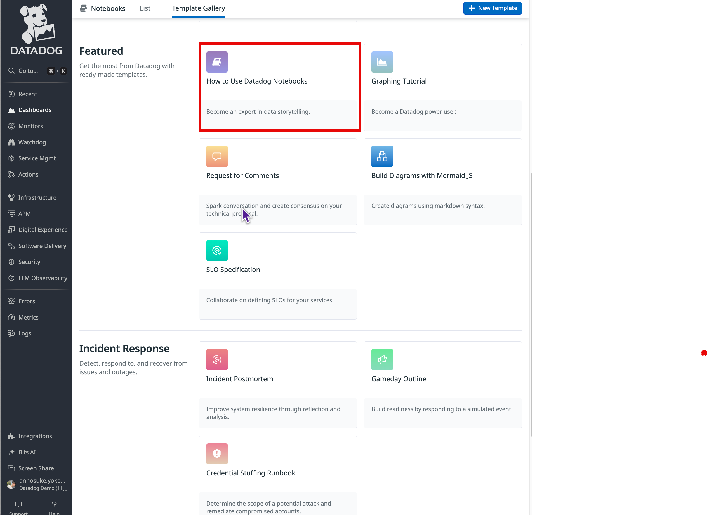
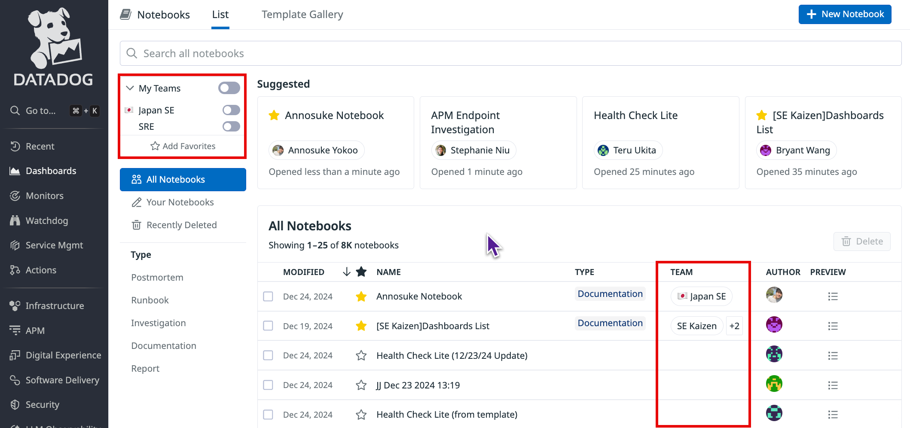

# はじめに
Datadog で Sales Engineer をしている [parupappa](https://x.com/866mfs)です

突然ですが、みなさん、**Datadog Notebook** 使っていますか？

中の人間が言うのもなんですが、数ある Deatadog の機能の中では、なかなかニッチな(存在感が薄い)機能なのではないかと思っています🧐

今回は、そんな Datadog Notebook について改めて存在感をアピールしていこうという記事になっております！

# Datadog Notebook
Datadog Notebook について知らない方はまずはこちらをご覧いただければなんとなく掴めると思います。

https://docs.datadoghq.com/ja/notebooks/#types-of-content

一言で言うと、Notion や Google Docs, Confluence などのドキュメントツールに、Datadog 独自のコンポーネントを組み込めるように拡張したものです。

Notebook ページの Template Gallery の中にも、How to use Daatadog Notebooks というテンプレートがあるのでそちらも合わせてご覧ください

主な使い方や Tips については 過去の Datadog Advent Calendar や Meetup で書かれた以下のブログがとても貴重なのでぜひご覧ください！
- [みんな！DatadogのNotebookを活用してくれ！](https://gomiba.co/archives/2021/12/datadog-notebook/)
- [DataDog Notebooks を活用して勉強する](https://qiita.com/raki/items/b86163a70ce5e3f55328)
- [Datadogの活用ノウハウを一挙に公開・それを支える全社管理者の工夫とは](https://techblog.zozo.com/entry/datadog-japan-meetup-2022-summer#4-%E9%9A%9C%E5%AE%B3%E8%AA%BF%E6%9F%BB%E3%82%84%E8%B2%A0%E8%8D%B7%E8%A9%A6%E9%A8%93%E3%81%AA%E3%81%A9%E3%81%A7%E3%83%A1%E3%83%88%E3%83%AA%E3%82%AF%E3%82%B9%E3%82%92%E8%A8%98%E9%8C%B2%E3%81%99%E3%82%8B%E3%81%AE%E3%81%8C%E5%A4%A7%E5%A4%89--Notebook)

なので、ここではよりユースケースに当てはめた形でご紹介しようと思います。

# How to use
## Case1 - Document Library
１つ目の使い方は、**ドキュメントライブラリー**として使用することです。

Datadog Notebook は Dashboard, Monitor, Log など Detadog 内で定義されるリソースに対して、ネイティブで統合されるため、コンポーネントを自由に埋め込むことが可能です！ （スクリーンショットのような静的画像ではないので、時系列データを保持したまま見ることが可能）

https://www.datadoghq.com/blog/incident-management-templates-notebooks-list/?_gl=1*lha1q4*_gcl_aw*R0NMLjE3MzQ0MjAyNzguQ2owS0NRaUF2UC02QmhEeUFSSXNBSjN1djdhQUdzamlBV1dOV0pJSldVdEFMQUZleldqNUN2b044T0pabkNVYnRjM3ZLbHRmeFdrSTl5WWFBcXhURUFMd193Y0I.*_gcl_au*MTI4MjI5NDUxNC4xNzMzODA1MTI4*_ga*NTY3MzcxMjg4LjE3MzM3OTc3MjE.*_ga_KN80RDFSQK*MTczNDUzNDY5NC4yNS4xLjE3MzQ1MzgyOTAuMC4wLjQ1MDkyOTI2Ng..*_fplc*MGduTmk3VWF2bWJWUERvUTBHSm9kWFZ0d3lNaGZkZnVyUFJZZUlMenlvRDJwT050bkVNaWNERUhFaXRueCUyRk15YkFRT3doRjEyMUlxMEp5SXFkWURkSiUyRkZRSmRPdGFZNGxpRm9ZTzhLQ1ZiQ2xvcDRkNVBUWDJBS3YzM25BUSUzRCUzRA..

### Template Gallery
少し上でも触れましたが、 Datadog では、カスタマイズ可能なすぐに使える Notebook として[Template Gallary](https://docs.datadoghq.com/ja/notebooks/#%E3%83%86%E3%83%B3%E3%83%97%E3%83%AC%E3%83%BC%E3%83%88%E3%82%AE%E3%83%A3%E3%83%A9%E3%83%AA%E3%83%BC)を提供しています。

個人的に特にオススメなのは、以下のテンプレートです
- Incident Postmortem
- Incident Report 

具体的な内容については後述します。

### Custom Temlates
またそれだけでなく、Custom Templates として、自分たちオリジナルのテンプレートを作成することができます。

なので例えば・・・
- team ごと（SRE, Platform, Application）での Datadog に関するオンボーディング Notebook 
- team ごとのコストレポートの雛形

などなど、特に Notebook では team でのタグやフィルタリングを設定できるので、team ごとでのテンプレートを Custom Templates として用意してもらうと機能とマッチするのではないかと感じています。

## Case2 - Insident Management
https://www.datadoghq.com/blog/incident-management-templates-notebooks-list/?_gl=1*lha1q4*_gcl_aw*R0NMLjE3MzQ0MjAyNzguQ2owS0NRaUF2UC02QmhEeUFSSXNBSjN1djdhQUdzamlBV1dOV0pJSldVdEFMQUZleldqNUN2b044T0pabkNVYnRjM3ZLbHRmeFdrSTl5WWFBcXhURUFMd193Y0I.*_gcl_au*MTI4MjI5NDUxNC4xNzMzODA1MTI4*_ga*NTY3MzcxMjg4LjE3MzM3OTc3MjE.*_ga_KN80RDFSQK*MTczNDUzNDY5NC4yNS4xLjE3MzQ1MzgyOTAuMC4wLjQ1MDkyOTI2Ng..*_fplc*MGduTmk3VWF2bWJWUERvUTBHSm9kWFZ0d3lNaGZkZnVyUFJZZUlMenlvRDJwT050bkVNaWNERUhFaXRueCUyRk15YkFRT3doRjEyMUlxMEp5SXFkWURkSiUyRkZRSmRPdGFZNGxpRm9ZTzhLQ1ZiQ2xvcDRkNVBUWDJBS3YzM25BUSUzRCUzRA..

2017

https://www.datadoghq.com/blog/data-driven-notebooks/

2020

https://www.datadoghq.com/blog/collaborative-notebooks-datadog/?_gl=1*iwpvom*_gcl_aw*R0NMLjE3MzQ0MjAyNzguQ2owS0NRaUF2UC02QmhEeUFSSXNBSjN1djdhQUdzamlBV1dOV0pJSldVdEFMQUZleldqNUN2b044T0pabkNVYnRjM3ZLbHRmeFdrSTl5WWFBcXhURUFMd193Y0I.*_gcl_au*MTI4MjI5NDUxNC4xNzMzODA1MTI4*_ga*NTY3MzcxMjg4LjE3MzM3OTc3MjE.*_ga_KN80RDFSQK*MTczNDUzNDY5NC4yNS4xLjE3MzQ1MzY5MTUuMC4wLjQ1MDkyOTI2Ng..*_fplc*TnJWRFhJUTFlcHUyR3E0cTFoSFpCZmxRWDJHaWcwNzMxM014YXFPc2NsVTZsJTJGZ3U1NHZmRXY4UEd2c1ZObGpZcXZOY0FBZmxoTUdGZ0pObWFrNEFJSmRUTU44UWhNT3o0TUZFdWFqTmdFY0NXZU9JZlZaMWVXSWcxJTJCalBBUSUzRCUzRA..

[Runbook](https://www.pagerduty.co.jp/blog/what-is-a-runbook/#%E3%83%A9%E3%83%B3%E3%83%96%E3%83%83%E3%82%AF%E3%82%92%E6%B4%BB%E7%94%A8%E3%81%99%E3%82%8B4%E3%81%A4%E3%81%AE%E3%83%A1%E3%83%AA%E3%83%83%E3%83%88)

## Case3 - Postmortem

https://www.datadoghq.com/blog/incident-postmortem-process-best-practices/?_gl=1*1r6ox9f*_gcl_aw*R0NMLjE3MzQ0MjAyNzguQ2owS0NRaUF2UC02QmhEeUFSSXNBSjN1djdhQUdzamlBV1dOV0pJSldVdEFMQUZleldqNUN2b044T0pabkNVYnRjM3ZLbHRmeFdrSTl5WWFBcXhURUFMd193Y0I.*_gcl_au*MTI4MjI5NDUxNC4xNzMzODA1MTI4*_ga*NTY3MzcxMjg4LjE3MzM3OTc3MjE.*_ga_KN80RDFSQK*MTczNDUzNDY5NC4yNS4xLjE3MzQ1MzgzMDMuMC4wLjQ1MDkyOTI2Ng..*_fplc*RjVNM0J5dXdJYWpLJTJGOFN5anJzOUF4S1prUmxmbThzYSUyRlRWOENoa0F2ViUyQlRTZk1JWllyTFh3Z3QyJTJCbWpLUzVLSGx5VXlTcmhqUng0M1FoMTlhRWtLN0k4dmdnWFdZZ0JJV1hZRVpUUFNMQ3hXVXQyYU00YW9sNVluM0t4QUElM0QlM0Q.

今年のDashでBits AIを活用したIncidentについて説明がされてますが、その中でNotebookにこれまでの経緯をまとめてくれるとか、Postmortem自動で書いてくれるとかが説明されてます

具体的な使い方イメージは動画を見ていただけるとイメージがつくかと思います！
https://www.youtube.com/watch?v=ZMNXNH-kJAM&t=5100s

https://www.datadoghq.com/blog/bits-ai-autonomous-investigations/

# Others
## Terraform 対応
Datadog の terraform provier に2019年から [Support for Notebook resources #261](https://github.com/DataDog/terraform-provider-datadog/issues/261)として issue が上がっていますが、今だ採用にはいたっていません...

https://github.com/DataDog/terraform-provider-datadog/issues/261

issue の中で、機能実装を望む声は多く上がっていそうですが、使い方として難しいが理由ではないかと推察しています。
[datadog_dashboard](https://registry.terraform.io/providers/DataDog/datadog/latest/docs/resources/dashboard) と同じく、インタラクティブに操作することがメインとなる使い方なので、resource の管理面や運用の仕方が難しくなりそうですね

# さいごに
Datadog Notebook のユースケースについて紹介する Advent Calendar をお送りしました。

他にもこんな使い方をしている！というのがあれば、ぜひぜひコメントください📝

コストはかからないので、ぜひ今後は Datadog Notebook を活用してみてください☺️
