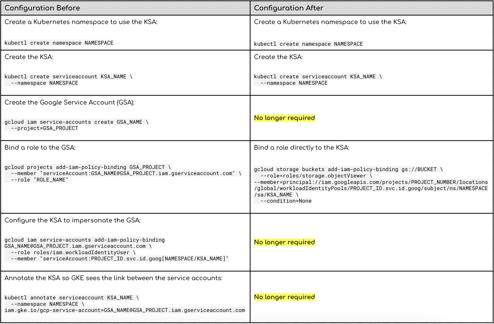

# はじめに


https://cloud.google.com/kubernetes-engine/docs/concepts/workload-identity#configure-workloads

# なにが変わったのか
これまで、GKE で Workload Identity 連携を使う場合、Google Cloud の Service Account（以降：GSA） を Kubernetes の Service Account（以降：KSA） に紐づける必要がありました。これにより、GKE の Pod が GCP のリソースにアクセスする際に、GCP の Service Account を使うことができました。




【引用元】
- https://twitter.com/_techcet_/status/1773865010651173293
- https://twitter.com/_techcet_/status/1773865012320440390

# External Secrets Operator を使用して、Secretを取得する時で検証してみる
GKE の Workload Identity連携を有効にする（Autopilot モードだとデフォルトで有効になっています。）


```bash
$ k create ns test-application
namespace/test-application created

$ k apply -f workload-identify-for-gke.yaml
serviceaccount/external-secrets-serviceaccount created

$ k get sa -n test-application
NAME                              SECRETS   AGE
default                           0         36s
external-secrets-serviceaccount   0         10s


